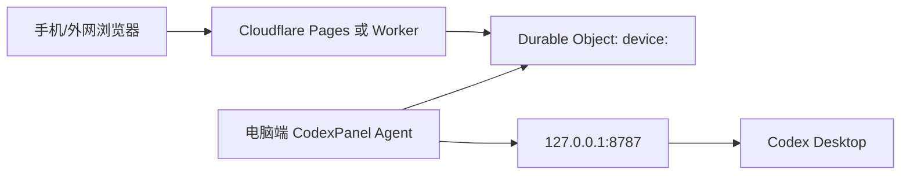

# CodexPanel-WAN

CodexPanel-WAN 是从 CodexPanel 项目中拆出的 Cloudflare 广域网中转服务。它让手机、平板或另一台电脑可以通过 Cloudflare 访问家里/办公室电脑上的 CodexPanel 本地服务，而电脑不需要开放公网端口，也不需要做路由器端口映射。

这个仓库只包含 Cloudflare 服务端代码，不包含桌面端 CodexPanel Agent。真正控制 Codex Desktop、读取会话、发送输入、校验远控 token 的仍然是用户自己电脑上的 CodexPanel 本地服务。

## 一句话架构

手机访问 `https://你的域名/remote/<deviceId>/...`，Cloudflare 把请求放进对应设备的 Durable Object 队列；电脑端 Agent 通过出站长轮询从 `/agent/<deviceId>/poll` 取走请求，转发到本机 `127.0.0.1:8787`，再把响应发回 `/agent/<deviceId>/respond`。



## 适合做什么

- 在不暴露家庭公网 IP、不做端口映射的情况下，从外网访问自己的 CodexPanel。
- 给每台电脑分配一个 `deviceId`，通过同一个 Cloudflare 项目中转多台设备。
- 在 `workers.dev` 访问不稳定时，使用 Cloudflare Pages 自定义域名作为远程入口。
- 给 CodexPanel 之外的本地 HTTP 服务复用同一套“电脑主动出站长轮询”的中转协议。

## 不适合做什么

- 不适合当多人共享的商业 SaaS relay。许可证限制非商业使用。
- 不适合传超大文件或视频流；请求体会经过 Worker/Durable Object，受 Cloudflare 平台限制。
- 不提供独立账号系统。远程访问安全主要依赖本地 CodexPanel token、设备白名单、Cloudflare Access 或自定义鉴权层。
- 不是 WebSocket 隧道。当前实现是 HTTP 请求/响应中转。

## 仓库结构

```text
CodexPanel-WAN/
  src/relay-worker.mjs          # 单 Worker 部署入口，也定义 Durable Object 类
  pages/_worker.js              # Cloudflare Pages advanced mode 入口
  wrangler.toml.example         # 单 Worker 部署示例
  wrangler.do.toml.example      # Pages 推荐部署中的内部 DO Worker 示例
  pages/wrangler.toml.example   # Pages 推荐部署示例
  .github/workflows/
    deploy-cloudflare.yml       # GitHub Actions 自动部署模板
```

`src/relay-worker.mjs` 和 `pages/_worker.js` 当前逻辑保持一致。Pages 推荐部署需要一个内部 Durable Object Worker，因此 Pages 入口也带有同样的路由逻辑，方便以后切换部署形态。

## 功能详细说明

### 1. 健康检查

`GET /health`

返回：

```json
{
  "ok": true,
  "service": "codexpanel-wan",
  "now": "2026-07-01T00:00:00.000Z"
}
```

用途：

- 验证 Cloudflare 部署是否在线。
- 给自动化脚本、监控、GitHub Actions 部署后检查使用。

### 2. 外网远程入口

`/remote/<deviceId>/...`

手机或外网浏览器访问这个路径。Cloudflare 会：

1. 校验 `deviceId` 格式。
2. 如果设置了 `DEVICE_IDS`，检查设备是否在白名单内。
3. 根据 `deviceId` 找到唯一 Durable Object 实例。
4. 把浏览器请求转成一个 task，等待电脑端 Agent 取走。
5. Agent 返回响应后，把响应原样返回给浏览器。

示例：

```text
https://codexpanel-wan.pages.dev/remote/my-mac/?token=你的本机远控token
https://codex.example.com/remote/home-pc/control.html?token=你的本机远控token
```

### 3. 电脑端 Agent 取任务

`POST /agent/<deviceId>/poll`

电脑端 Agent 长轮询这个接口。请求体可以带元信息：

```json
{
  "agent": "codex",
  "deviceId": "my-mac",
  "workerIndex": 0,
  "localBase": "http://127.0.0.1:8787",
  "now": "2026-07-01T00:00:00.000Z"
}
```

如果队列里有外网请求，Cloudflare 返回：

```json
{
  "type": "request",
  "requestId": "uuid",
  "deviceId": "my-mac",
  "method": "POST",
  "path": "/api/send?token=xxx",
  "headers": {
    "content-type": "application/json"
  },
  "bodyBase64": "eyJ0ZXh0IjoiaGkifQ==",
  "createdAt": "2026-07-01T00:00:00.000Z"
}
```

如果暂时没有请求，长轮询会等待 `AGENT_POLL_TIMEOUT_MS`，然后返回：

```json
{
  "type": "idle",
  "now": "2026-07-01T00:00:25.000Z"
}
```

### 4. 电脑端 Agent 回传响应

`POST /agent/<deviceId>/respond`

Agent 把本地服务的 HTTP 响应转成 JSON 发回：

```json
{
  "requestId": "uuid",
  "status": 200,
  "headers": {
    "content-type": "application/json; charset=utf-8"
  },
  "bodyBase64": "eyJvayI6dHJ1ZX0="
}
```

Cloudflare 会找到正在等待这个 `requestId` 的浏览器请求，并把响应返回给浏览器。如果浏览器已经断开或超时，会返回 `410 CLIENT_GONE`，Agent 可以忽略这个错误。

## 实现原理

### Durable Object 按设备隔离队列

每个设备使用一个固定 Durable Object ID：

```js
env.RELAY_SESSION.idFromName(`device:${deviceId}`)
```

这意味着：

- `my-mac` 的请求只会进 `device:my-mac` 队列。
- `home-pc` 的请求只会进 `device:home-pc` 队列。
- 每个设备有独立的 `pendingRequests`、`waitingClients`、`waitingPollers` 和 `lastAgentSeenAt`。

### 为什么电脑不用开放端口

浏览器请求进入 Cloudflare 后不会直接连接电脑。电脑端 Agent 主动从内网向 Cloudflare 发起 HTTPS 请求：

```text
电脑 -> Cloudflare: POST /agent/<deviceId>/poll
```

这是普通出站 HTTPS 流量，通常不受 NAT 和路由器端口映射影响。Cloudflare 只在 Agent 已经连上来时把外网请求交给它。

### 长轮询如何减少延迟

如果当前没有待处理请求，Agent 的 `/poll` 请求不会立刻返回，而是在 Durable Object 里挂起一段时间。外网请求进来时：

1. Durable Object 发现有等待中的 poller。
2. 立即把 task 返回给这个 poller。
3. Agent 立刻访问本机服务并回传响应。

这样比固定每秒轮询更省请求，也更快。

### 请求体与二进制兼容

Worker 和 Agent 之间的协议使用 JSON。为了兼容上传附件、图片等二进制 body，请求体和响应体都用 Base64 字段传输：

- `bodyBase64` 为空字符串表示没有 body。
- 非空时由 Agent 解码为 bytes，再转发给本机服务。

### Header 处理

中转会过滤 hop-by-hop header，例如：

- `connection`
- `content-length`
- `host`
- `keep-alive`
- `transfer-encoding`
- `upgrade`

同时会过滤 `cf-*` header，避免 Cloudflare 内部头被转发到本机服务。

### CORS 与 Private Network Access

所有响应都会附加：

```http
access-control-allow-origin: *
access-control-allow-methods: GET,POST,HEAD,OPTIONS
access-control-allow-headers: content-type,x-mobile-typer-token,authorization
access-control-allow-private-network: true
```

这是为了让移动端网页、PWA 和本地 CodexPanel 前端在跨域场景下可用。

## 环境变量

这些变量写在 Wrangler 配置的 `[vars]` 中。Pages 推荐部署时，`wrangler.do.toml` 和 `pages/wrangler.toml` 都建议保持一致。

| 变量 | 默认值 | 说明 |
| --- | --- | --- |
| `DEVICE_IDS` | 空 | 逗号分隔的设备白名单，例如 `my-mac,my-windows-pc`。为空时允许任意合法 deviceId。 |
| `DEVICE_ID` | 空 | 兼容单设备写法。`DEVICE_IDS` 优先。 |
| `CLIENT_TIMEOUT_MS` | `65000` | 浏览器请求等待 Agent 响应的最长时间。 |
| `AGENT_POLL_TIMEOUT_MS` | `25000` | Agent 长轮询无任务时最长挂起时间。 |
| `AGENT_STALE_MS` | `45000` | 超过这个时间没看到 Agent，就认为设备离线。 |
| `MAX_BODY_BYTES` | `33554432` | 单个请求 body 最大字节数，默认 32 MiB。 |

`deviceId` 只能包含字母、数字、点、下划线、短横线，长度 3 到 80：

```text
my-mac
home_pc
windows.01
```

## 部署方式选择

推荐优先使用 **Cloudflare Pages + 内部 Durable Object Worker**：

- Pages 自定义域名通常更容易被手机网络访问。
- Durable Object Worker 可以设置 `workers_dev = false`，不暴露独立 Worker 域名。
- 对外只需要记住 Pages 地址或自定义域名。

备用方案是 **单 Worker 部署**：

- 命令更少。
- 直接使用 Worker 的 `workers.dev` 域名或绑定自定义域名。
- 如果你的网络环境能稳定访问 `workers.dev`，这个方式也可以。

## 前置条件

1. Cloudflare 账号，并启用 Workers/Durable Objects。部分账号可能需要绑定付款方式或启用对应套餐。
2. Node.js 18.17 或更高版本。
3. npm。
4. 可以登录 Cloudflare 的 Wrangler。
5. 电脑端已运行 CodexPanel 或兼容 Agent。

安装依赖：

```bash
npm install
npm run check
```

登录 Cloudflare：

```bash
npx wrangler login
```

如果是在 CI 或服务器环境，不使用浏览器登录，而是设置：

```bash
export CLOUDFLARE_API_TOKEN="你的 Cloudflare API Token"
export CLOUDFLARE_ACCOUNT_ID="你的 Cloudflare Account ID"
```

PowerShell：

```powershell
$env:CLOUDFLARE_API_TOKEN = "你的 Cloudflare API Token"
$env:CLOUDFLARE_ACCOUNT_ID = "你的 Cloudflare Account ID"
```

## 推荐部署：Pages + Durable Object Worker

### Bash/macOS/Linux

```bash
git clone https://github.com/<你的GitHub用户名或组织>/CodexPanel-WAN.git
cd CodexPanel-WAN

npm install
npm run check
npx wrangler login

cp wrangler.do.toml.example wrangler.do.toml
cp pages/wrangler.toml.example pages/wrangler.toml

# 可选：编辑 wrangler.do.toml 和 pages/wrangler.toml 的 [vars]
# DEVICE_IDS = "my-mac,my-windows-pc"

npm run deploy:do
npx wrangler pages project create codexpanel-wan --production-branch main
npm run deploy:pages
```

如果 Pages 项目已经存在，`wrangler pages project create` 可能报“already exists”，可以忽略，然后继续执行 `npm run deploy:pages`。

### Windows PowerShell

```powershell
git clone https://github.com/<你的GitHub用户名或组织>/CodexPanel-WAN.git
Set-Location .\CodexPanel-WAN

npm install
npm run check
npx wrangler login

Copy-Item .\wrangler.do.toml.example .\wrangler.do.toml
Copy-Item .\pages\wrangler.toml.example .\pages\wrangler.toml

# 可选：编辑 wrangler.do.toml 和 pages\wrangler.toml 的 [vars]
# DEVICE_IDS = "my-mac,my-windows-pc"

npm run deploy:do
npx wrangler pages project create codexpanel-wan --production-branch main
npm run deploy:pages
```

部署完成后，你会得到类似地址：

```text
https://codexpanel-wan.pages.dev
```

测试：

```bash
curl https://codexpanel-wan.pages.dev/health
```

预期返回 `{"ok":true,...}`。

## 备用部署：单 Worker

### Bash/macOS/Linux

```bash
git clone https://github.com/<你的GitHub用户名或组织>/CodexPanel-WAN.git
cd CodexPanel-WAN

npm install
npm run check
npx wrangler login

cp wrangler.toml.example wrangler.toml

# 可选：编辑 wrangler.toml 的 [vars]
# DEVICE_IDS = "my-mac,my-windows-pc"

npm run deploy:worker
```

### Windows PowerShell

```powershell
git clone https://github.com/<你的GitHub用户名或组织>/CodexPanel-WAN.git
Set-Location .\CodexPanel-WAN

npm install
npm run check
npx wrangler login

Copy-Item .\wrangler.toml.example .\wrangler.toml

# 可选：编辑 wrangler.toml 的 [vars]
# DEVICE_IDS = "my-mac,my-windows-pc"

npm run deploy:worker
```

测试：

```bash
curl https://codexpanel-wan.<你的账号>.workers.dev/health
```

## 配置电脑端 CodexPanel Agent

Cloudflare 部署好以后，电脑端需要知道两个信息：

- `CODEX_RELAY_URL`：Cloudflare 服务根地址，不带最后的 `/remote/...`。
- `CODEX_RELAY_DEVICE_ID`：这台电脑的设备 ID，必须和远程 URL 中一致。

还需要有本机远控 token。CodexPanel 当前使用 `CODEX_REMOTE_KEY` 或控制台保存的远控密钥生成手机访问链接。

### macOS/Linux 示例

```bash
export CODEX_RELAY_URL="https://codexpanel-wan.pages.dev"
export CODEX_RELAY_DEVICE_ID="my-mac"
export CODEX_REMOTE_KEY="换成你自己的远控密钥"
node server.js
```

### Windows PowerShell 示例

```powershell
$env:CODEX_RELAY_URL = "https://codexpanel-wan.pages.dev"
$env:CODEX_RELAY_DEVICE_ID = "my-windows-pc"
$env:CODEX_REMOTE_KEY = "换成你自己的远控密钥"
node .\server.js
```

CodexPanel 启动日志里会出现类似内容：

```text
Codex relay agent enabled for device "my-mac".
Remote URL: https://codexpanel-wan.pages.dev/remote/my-mac/
Remote access key: ********
```

手机打开：

```text
https://codexpanel-wan.pages.dev/remote/my-mac/?token=你的远控密钥
```

如果你使用 Pages 自定义域名，把 `CODEX_RELAY_URL` 换成自定义域名：

```bash
export CODEX_RELAY_URL="https://codex.example.com"
```

## GitHub Actions 自动部署

本仓库内置 `.github/workflows/deploy-cloudflare.yml`。推送到 `main` 或手动运行 workflow 时，会自动：

1. 安装 npm 依赖。
2. 生成 Wrangler 配置。
3. 部署内部 Durable Object Worker。
4. 创建或复用 Pages 项目。
5. 部署 Pages advanced mode 入口。
6. 访问 `/health` 做部署后检查。

### GitHub Secrets

在 GitHub 仓库设置里添加：

| Secret | 必填 | 用途 |
| --- | --- | --- |
| `CLOUDFLARE_API_TOKEN` | 是 | Wrangler 部署权限。 |
| `CLOUDFLARE_ACCOUNT_ID` | 是 | Cloudflare Account ID。 |

API Token 至少需要能编辑 Workers Scripts、Cloudflare Pages，并读取账号信息。若后续要自动绑定自定义域名，还需要相应 Zone 权限。

### GitHub Variables

可选仓库变量：

| Variable | 默认值 | 用途 |
| --- | --- | --- |
| `DO_WORKER_NAME` | `codexpanel-wan-do` | 内部 Durable Object Worker 名称。 |
| `PAGES_PROJECT_NAME` | `codexpanel-wan` | Cloudflare Pages 项目名称。 |
| `DEVICE_IDS` | 空 | 设备白名单，例如 `my-mac,my-windows-pc`。 |

### AI 自动部署指令

如果你把这个仓库交给另一个 AI 或自动化 Agent，让它按下面顺序执行即可：

```text
目标：部署 CodexPanel-WAN 到 Cloudflare Pages + Durable Object Worker。

输入：
- GitHub 仓库：CodexPanel-WAN
- Cloudflare Account ID：来自 CLOUDFLARE_ACCOUNT_ID
- Cloudflare API Token：来自 CLOUDFLARE_API_TOKEN
- Pages 项目名：codexpanel-wan，除非用户指定其他名字
- DO Worker 名：codexpanel-wan-do，除非用户指定其他名字
- 设备白名单：DEVICE_IDS，可为空

步骤：
1. 进入仓库根目录。
2. 运行 npm install。
3. 运行 npm run check。
4. 复制 wrangler.do.toml.example 为 wrangler.do.toml。
5. 复制 pages/wrangler.toml.example 为 pages/wrangler.toml。
6. 如果用户指定了 DO_WORKER_NAME，修改 wrangler.do.toml 的 name，并修改 pages/wrangler.toml 的 script_name。
7. 如果用户指定了 PAGES_PROJECT_NAME，修改 pages/wrangler.toml 的 name，并在部署 Pages 时使用同名 project。
8. 如果用户指定了 DEVICE_IDS，在两个 toml 的 [vars] 中设置 DEVICE_IDS。
9. 使用 npx wrangler deploy --config wrangler.do.toml 部署 DO Worker。
10. 使用 npx wrangler pages project create <PAGES_PROJECT_NAME> --production-branch main 创建 Pages 项目；如果已存在则继续。
11. 使用 cd pages && npx wrangler pages deploy . --project-name <PAGES_PROJECT_NAME> --branch main 部署 Pages。
12. 访问 https://<PAGES_PROJECT_NAME>.pages.dev/health，确认 ok 为 true。
13. 输出给用户：CODEX_RELAY_URL=https://<PAGES_PROJECT_NAME>.pages.dev，CODEX_RELAY_DEVICE_ID=<用户设备ID>。
```

## 自定义域名

推荐给 Pages 项目绑定自己的域名，例如：

```text
https://codex.example.com
```

绑定后电脑端配置：

```bash
export CODEX_RELAY_URL="https://codex.example.com"
export CODEX_RELAY_DEVICE_ID="my-mac"
```

手机访问：

```text
https://codex.example.com/remote/my-mac/?token=你的远控密钥
```

如果要增加一层登录保护，建议在 Cloudflare Zero Trust 里给这个域名启用 Cloudflare Access。

## 安全建议

- 必须设置强远控密钥。`token` 泄露后，别人可能远程操作你的 CodexPanel。
- 建议设置 `DEVICE_IDS` 白名单。
- 建议使用 Cloudflare Access 保护自定义域名。
- 不要把远程 URL、token、Cloudflare API Token、GitHub Secrets 发到公开聊天或工单。
- `DEVICE_IDS` 是路由白名单，不是强认证。强认证应该由本地 CodexPanel token 和 Cloudflare Access 提供。
- 电脑端 Agent 只需要出站 HTTPS，不要为了这个服务开放本地端口到公网。

## 常见故障

| 现象 | 可能原因 | 处理 |
| --- | --- | --- |
| `/health` 不通 | Cloudflare 部署失败或域名未生效 | 重新运行部署命令，检查 Wrangler 输出和 DNS。 |
| 手机返回 `AGENT_OFFLINE` | 电脑端 Agent 没启动，或 `deviceId` 不一致 | 启动 CodexPanel，确认 `CODEX_RELAY_DEVICE_ID` 和 URL 中的 deviceId 完全一致。 |
| 手机返回 `AGENT_TIMEOUT` | Agent 在线但本地服务处理超时 | 确认 `127.0.0.1:8787` 可访问；必要时调大 `CLIENT_TIMEOUT_MS` 和 `CODEX_RELAY_REQUEST_TIMEOUT_MS`。 |
| 返回 `DEVICE_NOT_ALLOWED` | 设置了 `DEVICE_IDS` 但不包含当前设备 | 把设备 ID 加到 `DEVICE_IDS`，并重新部署。 |
| 上传失败或 413 | body 超过 `MAX_BODY_BYTES` 或 Cloudflare 平台限制 | 减小附件，或调大 `MAX_BODY_BYTES` 到平台允许范围内。 |
| Pages 部署后 Durable Object 报错 | `script_name` 和 DO Worker 名不一致 | 确认 `pages/wrangler.toml` 的 `script_name` 等于 `wrangler.do.toml` 的 `name`。 |
| GitHub Actions 失败 | Secrets/Variables 缺失或 API Token 权限不足 | 检查 `CLOUDFLARE_API_TOKEN`、`CLOUDFLARE_ACCOUNT_ID` 和 token 权限。 |

## 开发与验证

语法检查：

```bash
npm run check
```

本地 Worker 开发：

```bash
cp wrangler.toml.example wrangler.toml
npx wrangler dev --config wrangler.toml
```

本地访问：

```bash
curl http://127.0.0.1:8787/health
```

注意：完整远程链路需要电脑端 Agent 同时运行，否则 `/remote/<deviceId>/...` 会返回离线或超时。

## 许可证

本仓库沿用 Codex Source-Available Non-Commercial License 1.0。允许个人、教育、研究、评估等非商业用途使用、修改、发布和分发；商业用途需要作者书面授权。
